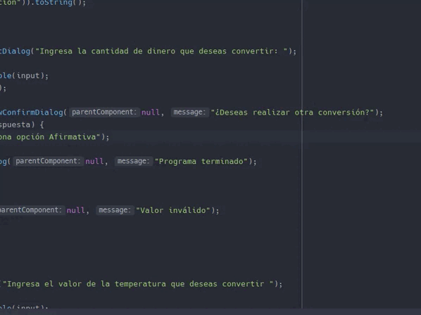

# Challenge ONE-ORACLE NEXT EDUCATION

 

## Conversor de Monedas y Temperatura

>Descripción

**Bienvenido al primer desafío del Challenge Java!**

En esta oportunidad, a los Devs se nos solicitó crear un conversor de divisas utilizando el lenguaje Java. Las características solicitadas por nuestro cliente son las siguientes:

Este cuadro de dialogo debe permitir al usuario escoger entre las opciones de conversión, según los requisitos solo es necesario hacer un conversor de moneda pero en caso que desees implementar otras funciones en la foto anexada podemos ver una opción de menú con otras funciones.

    

  Es hora de mostrar para nuestro usuário el valor de la conversión realizada.
  - Utilice el método **showMessageDialog** para mostrar el valor de la conversión.
  

           
                 
               
Recuerda que este input debe estar validado y no debe aceptar otro tipo de caracteres que no sean del tipo numéricos.

Utilice el método showInputDialog para que el usuario inserte un valor.

 

 
Utilice la clase  	**JOptionPane**  de la biblioteca **Javax**;
- Utilice el método **showInputDialog** como un objeto para presentar más de una opción;

Requisitos:
- **El convertidor de moneda debe:**

       - Convertir de la moneda de tu país  a Dólar
       - Convertir de la moneda de tu país  a Euros
       - Convertir de la moneda de tu país  a Libras Esterlinas
       - Convertir de la moneda de tu país  a Yen Japonés
       - Convertir de la moneda de tu país  a Won sul-coreano

- **Recordando que también debe ser posible convertir inversamente, es decir:**

       - Convertir de Dólar a la moneda de tu país
       - Convertir de Euros a la moneda de tu país
       - Convertir de Libras Esterlinas a la moneda de tu país
       - Convertir de Yen Japonés a la moneda de tu país
       - Convertir de Won sul-coreano a la moneda de tu país
       
       

Tecnologias Usadas en este Challenge

| Herramientas | Languages |
|-----:|-----------|
|  Windows 11    | Java   |
|  IntelliJ IDEA | Spring |
|                |        |

## Muestra formato Gif funcionalidad del conversor de moneda y temperatura.

>video:

